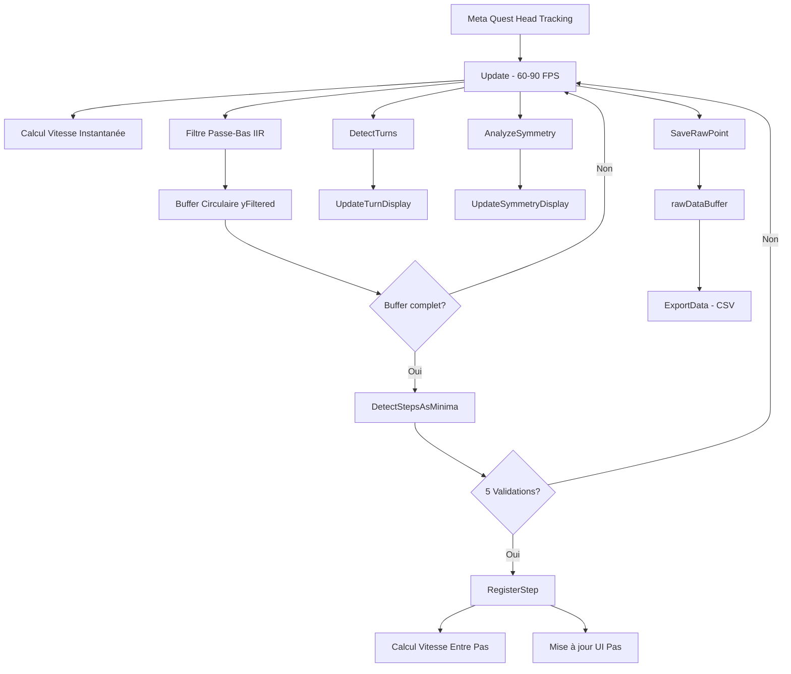

# Livret Technique - WalkingScan
## Système de détection de paramètres de marche en temps réel via casque XR Meta Quest

---

## Table des Matières

1. [Vue d'ensemble du projet](#vue-densemble-du-projet)
2. [Architecture du système](#architecture-du-système)
3. [Algorithmes de détection](#algorithmes-de-détection)
4. [Spécifications techniques](#spécifications-techniques)
5. [Guide d'implémentation Unity](#guide-dimplémentation-unity)
6. [Format des données exportées](#format-des-données-exportées)
7. [Paramètres configurables](#paramètres-configurables)
8. [Validation et performances](#validation-et-performances)

---

## 1. Vue d'ensemble du projet

### 1.1 Objectif

WalkingScan est un système de détection et d'analyse de marche en temps réel développé pour Meta Quest. Le système utilise le tracking 6-DOF (6 Degrees of Freedom) du casque VR pour détecter et analyser :

- **Nombre de pas** : Détection précise basée sur les mouvements verticaux de la tête
- **Longueur des pas** : Distance horizontale (XZ) entre chaque pas
- **Vitesse de marche** : Deux métriques distinctes (entre chaque pas et instantanée)
- **Virages** : Détection gauche/droite basée sur la rotation YAW
- **Symétrie de marche** : Analyse de l'orientation de la tête et de la linéarité de trajectoire, basée sur les rotations ROLL et YAW.

### 1.2 Technologies utilisées

- **Casque XR** : Meta Quest 3
- **Plateforme** : Unity 6.2 avec Meta All-In-One SDK
- **Langage** : C# (et python)
- **Export de données** : CSV (séparateur point-virgule)

### 1.3 Différence avec l'analyse offline

Le projet comprend deux approches différentes :

| Caractéristique | Analyse Offline (Python) | Temps Réel (Unity C#) |
|----------------|--------------------------|----------------------|
| **Environnement** | Scripts Python | Meta Quest VR |
| **Traitement** | Batch sur fichiers CSV | Streaming temps réel |
| **Filtrage** | Scipy.signal (divers filtres) | IIR Butterworth causal |
| **Détection** | scipy.signal.find_peaks | Algorithme personnalisé |
| **Validation** | Ground truth BDD_*.csv | Feedback visuel immédiat |
| **Usage** | Optimisation paramètres | Application terrain |

---

## 2. Architecture du système

### 2.1 Structure du script `WalkingScan.cs`

```
RealtimeStepDetector (MonoBehaviour)
├── [Serialized] Références UI (6 TextMeshProUGUI)
├── [Serialized] Paramètres détection pas (5 variables)
├── [Serialized] Paramètres virages (3 variables)
├── [Serialized] Paramètres symétrie (3 variables)
├── [Serialized] Paramètres filtre (2 variables)
├── [Serialized] Debug & Enregistrement (2 booléens)
│
├── Variables internes
│ ├── Pas : stepCount, stepSpeed, instantaneousSpeed, positions, timestamps
│ ├── Virages : currentTurn, turnStartTime, accumulatedTurnAngle
│ ├── Symétrie : headOrientationScore, trajectoryLinearity
│ └── Vitesse instantanée : previousPosition, previousTime
│
├── Buffers circulaires (7 buffers)
│ ├── yRaw, yFiltered, xRaw, zRaw
│ ├── timestamps
│ └── headingAngles, rollAngles
│
├── Filtre IIR Butterworth
│ ├── Coefficients : a0, a1, a2, b1, b2
│ └── Historique : xPrev[3], yPrev[3]
│
└── Structures de données
├── StepEvent : timestamp, position, stepNumber, stepDistance
├── TurnEvent : startTime, endTime, totalAngle, direction
└── RawDataPoint : 12 champs (position, rotation, vitesses, symétrie)
```

### 2.2 Flux de données



### 3. Algorithmes de détection

## 3.1 Détection des pas (Minima locaux)

**Principe**
La détection repose sur l'identification de creux (minima locaux) dans le signal vertical filtré yFiltered, correspondant au moment où la tête atteint sa position la plus basse pendant un pas.

Étapes de validation (5 conditions obligatoires) :

```python
private void DetectStepsAsMinima()
{
    // 1. Vérification position dans buffer
    int index = yFiltered.Count - validationWindow - 1;
    if (index < validationWindow || index >= n - validationWindow)
        return;

    // 2. Vérification anti-duplication temporelle
    float time = timestamps[index];
    if (detectedPeakTimestamps.Any(t => Mathf.Abs(t - time) < 0.01f))
        return;

    // 3. Minimum local (dérivée nulle)
    if (!IsLocalMinimum(index)) return;
    
    // 4. Prominence suffisante (≥ 0.005m)
    if (!IsValidProminence(index)) return;
    
    // 5. Amplitude par rapport à moyenne (≥ 0.008m)
    if (!IsValidAmplitude(index)) return;
    
    // 6. Distance horizontale minimale (≥ 0.05m)
    if (!IsValidStepDistance(index)) return;

    RegisterStep(index, time);
}
```

**Formules mathématiques des validations**

**1. Minimum local**

Condition de dérivée nulle (approximation par différences finies) :

$$y_{\text{filtré}}[i] < y_{\text{filtré}}[i-1] \quad \text{et} \quad y_{\text{filtré}}[i] < y_{\text{filtré}}[i+1]$$

Aucun seuil (validation booléenne).

**2. Prominence (profondeur du creux)**

La prominence mesure la profondeur du minimum par rapport au maximum local environnant :

$$P(i) = \max_{k \in [i-w, i+w]} y_{\text{filtré}}[k] - y_{\text{filtré}}[i]$$

Condition : $P(i) \geq P_{\text{seuil}}$ avec $P_{\text{seuil}} = 0.005$ m

où $w$ = `validationWindow` (par défaut 3 échantillons).

**3. Amplitude locale**

L'amplitude vérifie que le creux s'écarte suffisamment de la moyenne locale :

$$A(i) = \left| y_{\text{filtré}}[i] - \bar{y}_i \right|$$

avec la moyenne locale :

$$\bar{y}_i = \frac{1}{2w+1} \sum_{k=i-w}^{i+w} y_{\text{filtré}}[k]$$

Condition : $A(i) \geq A_{\text{seuil}}$ avec $A_{\text{seuil}} = 0.008$ m

**4. Distance temporelle**

Temps minimal entre deux pas consécutifs :

$$\Delta t = t[i] - t[i-1] \geq \Delta t_{\text{min}}$$

avec $\Delta t_{\text{min}} = 0.2$ s (correspond à une cadence maximale de 300 pas/min).

**5. Distance spatiale horizontale**

Distance euclidienne dans le plan horizontal (XZ) :

$$D_{\text{XZ}}(i) = \sqrt{(x[i] - x[i-1])^2 + (z[i] - z[i-1])^2}$$

Condition : $D_{\text{XZ}}(i) \geq D_{\text{min}}$ avec $D_{\text{min}} = 0.05$ m

Cette validation filtre les faux positifs dus aux mouvements stationnaires (flexions, oscillations sur place).

**6. Variation verticale entre pas consécutifs**

Cette validation finale vérifie que la hauteur (Y) du pas actuel ne diffère pas excessivement du dernier pas enregistré. Elle empêche la détection de pas lors de changements brusques d'altitude (montée/descente d'escaliers, obstacles).

$$\Delta Y(i) = |y_{\text{filtré}}[i] - y_{\text{filtré}}[i-1]|$$

Condition : $\Delta Y(i) \leq \Delta Y_{\text{max}}$ avec $\Delta Y_{\text{max}} = 0.2$ m

**Implémentation** : Cette vérification se fait dans `RegisterStep()` après toutes les autres validations :

```csharp
if (Mathf.Abs(currentY - lastY) > maxYVariationThreshold)
{
    // Pas rejeté - variation trop importante sur l'axe Y
    return;
}
```

**Tableau récapitulatif**

| Validation | Formule | Seuil par défaut | Explication |
|------------|---------|------------------|-------------|
| Minimum local | $y[i] < y[i-1] \land y[i] < y[i+1]$ | - | Point le plus bas localement |
| Prominence | $\max(y[i-w:i+w]) - y[i]$ | 0.005 m | Profondeur du creux |
| Amplitude | $\|y[i] - \bar{y}_i\|$ | 0.008 m | Écart à la moyenne locale |
| Distance temporelle | $t[i] - t[i-1]$ | 0.2 s | Temps min entre pas |
| Distance spatiale | $\sqrt{(x[i]-x[i-1])^2 + (z[i]-z[i-1])^2}$ | 0.05 m | Distance horizontale min |
| Variation verticale | $\|y[i] - y[i-1]\|$ | 0.2 m | Variation max hauteur entre pas |

### 3.2 Filtre passe-bas IIR Butterworth

**Configuration**
- **Ordre** : 2 (biquad)
- **Type** : Passe-bas
- **Fréquence de coupure** : 2 Hz (configurable)
- **Fréquence d'échantillonnage** : 100 Hz
- **Causalité** : Oui (temps réel)

**Fonction de transfert**

$$H(z) = \frac{a_0 + a_1 z^{-1} + a_2 z^{-2}}{1 - b_1 z^{-1} - b_2 z^{-2}}$$

**Implémentation C#**

```csharp
private float ApplyLowPassFilter(float newValue)
{
    // Équation aux différences (Direct Form II)
    float y = a0 * newValue + a1 * xPrev[0] + a2 * xPrev[1] 
              + b1 * yPrev[0] + b2 * yPrev[1];
    
    // Mise à jour historique
    xPrev[1] = xPrev[0]; xPrev[0] = newValue;
    yPrev[1] = yPrev[0]; yPrev[0] = y;
    
    return y;
}
```

**Calcul des coefficients**

**Formules mathématiques**

Pour un filtre Butterworth passe-bas d'ordre 2 (biquad) :

**Étape 1 : Pulsation normalisée**

$$\omega = \frac{2\pi f_c}{f_s}$$

où :
- $f_c$ = fréquence de coupure (Hz) — par défaut 2 Hz
- $f_s$ = fréquence d'échantillonnage (Hz) — par défaut 100 Hz

**Étape 2 : Paramètre alpha (facteur d'amortissement)**

$$\alpha = \frac{\sin(\omega)}{2Q}$$

où $Q = 0.7071$ (facteur de qualité pour réponse Butterworth maximalement plate).

**Étape 3 : Coefficients non normalisés**

$$a'_0 = \frac{1 - \cos(\omega)}{2}$$

$$a'_1 = 1 - \cos(\omega)$$

$$a'_2 = \frac{1 - \cos(\omega)}{2}$$

$$b'_1 = -2\cos(\omega)$$

$$b'_2 = 1 - \alpha$$

**Étape 4 : Normalisation**

Tous les coefficients sont divisés par $b_0 = 1 + \alpha$ :

$$a_0 = \frac{a'_0}{1 + \alpha}, \quad a_1 = \frac{a'_1}{1 + \alpha}, \quad a_2 = \frac{a'_2}{1 + \alpha}$$

$$b_1 = \frac{b'_1}{1 + \alpha}, \quad b_2 = \frac{b'_2}{1 + \alpha}$$

**Valeurs numériques** (pour $f_c = 2$ Hz, $f_s = 100$ Hz) :

- $\omega \approx 0.1257$ rad
- $\alpha \approx 0.0888$
- $a_0 \approx 0.0036$, $a_1 \approx 0.0072$, $a_2 \approx 0.0036$
- $b_1 \approx -1.8226$, $b_2 \approx 0.8371$

**Implémentation C#**

```csharp
private void InitializeLowPassFilter()
{
    float omega = 2f * Mathf.PI * cutoffFrequency / sampleRate;
    float cosOmega = Mathf.Cos(omega);
    float sinOmega = Mathf.Sin(omega);
    float alpha = sinOmega / (2f * 0.7071f); // Q = 0.7071 (Butterworth)

    float b0 = 1f + alpha;
    a0 = ((1f - cosOmega) / 2f) / b0;
    a1 = (1f - cosOmega) / b0;
    a2 = a0;
    b1 = (2f * cosOmega) / b0;
    b2 = (alpha - 1f) / b0;
}
```

### 3.3 Calcul de la longueur et vitesse des pas

**Principe**  
À chaque pas détecté, le système calcule automatiquement :
1. **Longueur du pas** : Distance horizontale (XZ) entre deux pas consécutifs
2. **Vitesse entre pas** : Vitesse moyenne calculée sur la base du dernier intervalle de temps entre pas
3. **Vitesse instantanée** : Vitesse calculée à chaque frame (indépendante des pas)

#### 3.3.1 Longueur du pas

**Formule**

$$\text{Longueur}_{i} = \sqrt{(x_i - x_{i-1})^2 + (z_i - z_{i-1})^2}$$

où $(x_i, z_i)$ représente la position horizontale du pas $i$ (plan XZ, sans la composante verticale Y).

**Implémentation C#**

```csharp
private float HorizontalDistance(Vector3 a, Vector3 b)
{
    float dx = a.x - b.x;
    float dz = a.z - b.z;
    return Mathf.Sqrt(dx * dx + dz * dz);
}

// Lors de l'enregistrement du pas :
float dist = detectedPeakPositions.Count > 1
    ? HorizontalDistance(pos, detectedPeakPositions[detectedPeakPositions.Count - 2])
    : HorizontalDistance(pos, initialPosition);
```

**Remarques**
- Le premier pas est calculé par rapport à la position initiale du casque
- Seule la distance horizontale est prise en compte (composante Y ignorée)
- La distance est stockée dans la structure `StepEvent`

#### 3.3.2 Vitesse entre pas

**Principe**  
Vitesse moyenne calculée entre les deux derniers pas détectés.

**Formule**

$$V_{\text{pas}} = \frac{\text{Longueur}_{i}}{t_i - t_{i-1}}$$

où :
- $\text{Longueur}_{i}$ : Distance horizontale du dernier pas (m)
- $t_i - t_{i-1}$ : Temps écoulé entre les deux derniers pas (s)

**Implémentation C#**

```csharp
private float CalculateWalkingSpeed()
{
    if (detectedSteps.Count < 2)
        return 0f; // Pas assez de données

    StepEvent lastStep = detectedSteps[detectedSteps.Count - 1];
    StepEvent previousStep = detectedSteps[detectedSteps.Count - 2];

    float distance = lastStep.stepDistance; // Distance horizontale (XZ)
    float deltaTime = lastStep.timestamp - previousStep.timestamp;

    if (deltaTime <= 0f)
        return 0f;

    return distance / deltaTime; // m/s
}
```

**Caractéristiques**
- Mise à jour uniquement lorsqu'un nouveau pas est détecté
- Retourne 0 si moins de 2 pas détectés
- Unité : mètres par seconde (m/s)

#### 3.3.3 Vitesse instantanée

**Principe**  
Vitesse calculée **à chaque frame** indépendamment de la détection de pas, basée sur le déplacement horizontal entre deux frames consécutives.

**Formule**

$$V_{\text{inst}} = \frac{\sqrt{(x_t - x_{t-1})^2 + (z_t - z_{t-1})^2}}{\Delta t}$$

où :
- $(x_t, z_t)$ : Position horizontale actuelle
- $(x_{t-1}, z_{t-1})$ : Position horizontale à la frame précédente
- $\Delta t$ : Temps écoulé entre les deux frames (généralement ~0.011s à 90 FPS)

**Implémentation C#**

```csharp
void Update()
{
    float currentTime = Time.time;
    Vector3 currentPos = mainCamera.transform.position;

    // Calculer la vitesse instantanée
    float deltaTime = currentTime - previousTime;
    if (deltaTime > 0f)
    {
        float dx = currentPos.x - previousPosition.x;
        float dz = currentPos.z - previousPosition.z;
        float distance = Mathf.Sqrt(dx * dx + dz * dz);
        instantaneousSpeed = distance / deltaTime;
    }

    // Mise à jour pour le prochain calcul
    previousPosition = currentPos;
    previousTime = currentTime;
}
```

**Différences clés avec la vitesse entre pas**

| Caractéristique | Vitesse entre pas | Vitesse instantanée |
|----------------|-------------------|---------------------|
| **Fréquence de mise à jour** | À chaque pas détecté | Chaque frame (60-90 Hz) |
| **Dépendance** | Détection de pas | Position casque uniquement |
| **Sensibilité au bruit** | Faible (moyennée) | Élevée (données brutes) |
| **Usage** | Vitesse de marche moyenne | Vitesse en temps réel |
| **Valeur à l'arrêt** | Dernière valeur calculée | ~0 m/s |

**Cas d'usage**
- **Vitesse entre pas** : Analyse de la cadence et de la vitesse de marche globale
- **Vitesse instantanée** : Détection d'arrêts, d'accélérations, feedback temps réel

---

### 3.4 Détection des virages

**Principe**  
Machine à états analysant l'angle de rotation YAW (rotation horizontale de la tête) pour détecter les virages gauche/droite.

**États**
- **TurnDirection.None** : Pas de virage en cours
- **TurnDirection.Left** : Virage à gauche en cours (YAW négatif)
- **TurnDirection.Right** : Virage à droite en cours (YAW positif)

**Algorithme**

```csharp
private void DetectTurns(float deltaYaw)
{
    accumulatedTurnAngle += deltaYaw;
    
    // Déclenchement virage (seuil : 30°)
    if (currentTurn == TurnDirection.None)
    {
        if (Mathf.Abs(accumulatedTurnAngle) >= turnThreshold)
        {
            currentTurn = (accumulatedTurnAngle > 0) ? 
                          TurnDirection.Right : TurnDirection.Left;
            turnStartTime = Time.time;
        }
    }
    // Fin de virage (seuil : 10°)
    else
    {
        if (Mathf.Abs(accumulatedTurnAngle) < turnEndThreshold)
        {
            RegisterTurn();
            currentTurn = TurnDirection.None;
            accumulatedTurnAngle = 0f;
        }
    }
}
```

**Paramètres**

| Paramètre | Valeur par défaut | Description |
|-----------|-------------------|-------------|
| `turnThreshold` | 30° | Angle minimum pour détecter un virage |
| `turnEndThreshold` | 10° | Angle en dessous duquel le virage se termine |
| `turnCooldown` | 1.0 s | Temps minimum entre deux virages |

### 3.5 Analyse de symétrie

La symétrie de marche est évaluée selon **deux composantes** :

#### 3.5.1 Symétrie d'orientation de la tête

Analyse la **stabilité angulaire** de la tête pendant la marche (angles YAW et ROLL).

**Méthode : Écart-type circulaire**

Les angles nécessitent un traitement spécial car ils sont **cycliques** (0° = 360°). L'écart-type classique donnerait des résultats erronés.

**Étape 1 : Moyenne circulaire**

$$\bar{\theta} = \text{atan2}\left(\frac{1}{n}\sum_{i=1}^{n}\sin(\theta_i), \frac{1}{n}\sum_{i=1}^{n}\cos(\theta_i)\right)$$

**Étape 2 : Écart-type circulaire**

$$\sigma_{\theta} = \sqrt{\frac{1}{n}\sum_{i=1}^{n}(\theta_i - \bar{\theta})^2}$$

où les différences $(\theta_i - \bar{\theta})$ sont normalisées dans $[-180°, +180°]$.

**Étape 3 : Conversion en score 0-100%**

$$\text{Score} = \text{Clamp}_{[0,1]}\left(1 - \frac{\sigma_{\theta}}{\text{seuil}}\right) \times 100$$

où **Clamp** (ou "écrêtage") limite la valeur dans l'intervalle [0, 1] :
- Si $1 - \frac{\sigma_{\theta}}{\text{seuil}} < 0$ → valeur = 0
- Si $1 - \frac{\sigma_{\theta}}{\text{seuil}} > 1$ → valeur = 1
- Sinon → valeur inchangée

**Paramètres**
- **Seuil par défaut** : 15° (configurable via `headTiltThreshold`)
- **Score 100%** : Écart-type = 0° (tête parfaitement stable)
- **Score 0%** : Écart-type ≥ 15° (tête très instable)

**Exemple de calcul**

Angles YAW mesurés sur 2 secondes : `[2°, -1°, 359°, 1°, 0°]`

1. Moyenne circulaire : $\bar{\theta} \approx 0.2°$
2. Écart-type circulaire : $\sigma \approx 1.3°$
3. Score YAW : $(1 - 1.3/15) \times 100 = 91.3\%$

**Implémentation C#**

```csharp
private float AnalyzeHeadOrientation()
{
    int windowSamples = Mathf.RoundToInt(symmetryWindowDuration * sampleRate);
    
    // Calcul écarts-types circulaires
    float yawStdDev = CalculateStdDev(headingAngles, n - windowSamples, n - 1);
    float rollStdDev = CalculateStdDev(rollAngles, n - windowSamples, n - 1);
    
    // Conversion en scores (0-100%)
    // Mathf.Clamp01 limite la valeur entre 0 et 1
    float yawScore = Mathf.Clamp01(1f - (yawStdDev / headTiltThreshold)) * 100f;
    float rollScore = Mathf.Clamp01(1f - (rollStdDev / headTiltThreshold)) * 100f;
    
    return (yawScore + rollScore) / 2f;
}
```

#### 3.5.2 Linéarité de trajectoire

Évalue si l'utilisateur marche en **ligne droite** en comparant :
- **Distance directe** : ligne droite entre premier et dernier pas
- **Distance réelle** : somme des distances entre chaque pas consécutif

**Formule**

$$\text{Score} = \frac{\text{Distance directe}}{\text{Distance réelle}} \times 100\%$$

**Interprétation**

| Score | Signification |
|-------|---------------|
| 100% | Ligne parfaitement droite |
| 95-99% | Légères oscillations normales |
| 80-95% | Trajectoire courbe ou zigzag |
| < 80% | Marche très irrégulière ou en cercle |

**Implémentation C#**

```csharp
private float AnalyzeTrajectoryLinearity()
{
    int startIndex = Mathf.Max(0, stepPositions.Count - trajectoryStepsWindow);
    if (stepPositions.Count - startIndex < 2) return 100f;

    // Distance directe (vol d'oiseau)
    Vector3 start = stepPositions[startIndex];
    Vector3 end = stepPositions[stepPositions.Count - 1];
    float directDistance = Vector3.Distance(start, end);

    // Distance réelle (somme des segments)
    float actualDistance = 0f;
    for (int i = startIndex + 1; i < stepPositions.Count; i++)
    {
        actualDistance += Vector3.Distance(stepPositions[i - 1], stepPositions[i]);
    }

    if (actualDistance < 0.01f) return 100f;
    
    float ratio = directDistance / actualDistance;
    return Mathf.Clamp(ratio, trajectoryLinearityThreshold, 1f) * 100f;
}
```

**Paramètres**

| Paramètre | Valeur par défaut | Description |
|-----------|-------------------|-------------|
| `symmetryWindowDuration` | 2.0 s | Fenêtre temporelle pour orientation |
| `trajectoryStepsWindow` | 5 pas | Nombre de pas pour linéarité |
| `headTiltThreshold` | 15° | Seuil d'écart-type pour orientation |
| `trajectoryLinearityThreshold` | 0.98 | Seuil minimum de linéarité |

---

## 4. Spécifications techniques

### 4.1 Performance et ressources

| Aspect | Valeur | Notes |
|--------|--------|-------|
| **Fréquence d'échantillonnage** | 100 Hz | Configurable via `sampleRate` |
| **Latence détection pas** | 150-300 ms | Dépend de `validationWindow` |
| **Taille buffer circulaire** | 300 échantillons | 3 secondes @ 100 Hz |
| **Consommation mémoire** | ~50 KB | 7 buffers + listes pas/virages |
| **Impact CPU** | < 1 ms/frame | Sur Meta Quest 3 @ 72 FPS |

### 4.2 Plages de valeurs typiques

| Métrique | Plage normale | Notes |
|----------|---------------|-------|
| **Cadence** | 80-120 pas/min | 1.3-2 pas/seconde |
| **Longueur de pas** | 0.5-0.8 m | Dépend de la taille de l'utilisateur |
| **Vitesse de marche** | 0.8-1.5 m/s | 2.9-5.4 km/h |
| **Amplitude verticale** | 0.03-0.08 m | Oscillation tête en marchant |
| **Angle virage** | 30-180° | Virage léger à demi-tour |

### 4.3 Limites connues

**Détection des pas**
- ❌ Pas très lents (< 0.5 pas/s) : amplitude insuffisante
- ❌ Pas très rapides (> 3 pas/s) : fenêtre de validation trop large
- ❌ Mouvements sans déplacement (flexions) : filtrés par `minStepDistance`

**Détection des virages**
- ⚠️ Rotation de la tête sans rotation du corps : faux positifs possibles
- ⚠️ Virages progressifs très lents : peuvent ne pas être détectés

**Symétrie**
- ⚠️ Fenêtre temporelle fixe (2s) : non adaptative
- ⚠️ Linéarité dépend du nombre de pas : nécessite ≥ 5 pas

---

## 5. Guide d'implémentation Unity

### 5.1 Configuration initiale

**Étape 1 : Créer le GameObject**

1. Créer un GameObject vide : `WalkingScanManager`
2. Ajouter le script `RealtimeStepDetector.cs`
3. Attacher au centre de la scène (ne pas l'attacher à la caméra)

**Étape 2 : Configurer l'UI**

Créer 6 TextMeshProUGUI dans le Canvas :
- `stepText` : "Pas: 0"
- `speedText` : "Vitesse: 0.00 m/s"
- `instantSpeedText` : "Vitesse inst: 0.00 m/s"
- `stepDistanceText` : "Longueur: 0.00 m"
- `turnText` : "Virage: Aucun"
- `symmetryText` : "Symétrie: Orientation 0% | Trajectoire 0%"

**Étape 3 : Assigner les références**

Dans l'Inspector, glisser-déposer les 6 TextMeshProUGUI dans les champs correspondants.

### 5.2 Configuration des paramètres

#### Paramètres recommandés par défaut

```csharp
[Header("Paramètres de détection des pas")]
public float prominenceThreshold = 0.005f;
public float amplitudeThreshold = 0.008f;
public float minTimeBetweenSteps = 0.2f;
public float minStepDistance = 0.05f;
public int validationWindow = 3;

[Header("Paramètres de filtrage")]
public float cutoffFrequency = 2f;
public float sampleRate = 100f;

[Header("Paramètres de détection des virages")]
public float turnThreshold = 30f;
public float turnEndThreshold = 10f;
public float turnCooldown = 1f;

[Header("Paramètres de symétrie")]
public float symmetryWindowDuration = 2f;
public int trajectoryStepsWindow = 5;
public float headTiltThreshold = 15f;
public float trajectoryLinearityThreshold = 0.98f;

[Header("Debug et enregistrement")]
public bool enableDebugLogs = false;
public bool recordRawData = true;
```

#### Ajustement pour différents cas d'usage

**Marche lente (personnes âgées)**
```csharp
prominenceThreshold = 0.003f;      // ↓ Plus sensible
amplitudeThreshold = 0.005f;       // ↓ Plus sensible
minTimeBetweenSteps = 0.3f;        // ↑ Pas plus lents
```

**Marche rapide (jeunes adultes)**
```csharp
prominenceThreshold = 0.007f;      // ↑ Moins sensible
amplitudeThreshold = 0.010f;       // ↑ Moins sensible
minTimeBetweenSteps = 0.15f;       // ↓ Pas plus rapides
```

**Environnement bruité**
```csharp
cutoffFrequency = 1.5f;            // ↓ Filtrage plus agressif
prominenceThreshold = 0.008f;      // ↑ Réduire faux positifs
```

### 5.3 Export des données

**Déclenchement automatique**

L'export se déclenche automatiquement à la fermeture de l'application (`OnApplicationQuit()`).

**Déclenchement manuel**

Appuyer sur la touche **E** pendant l'exécution pour exporter immédiatement.

**Localisation des fichiers**

Les fichiers CSV sont exportés dans :
```
/sdcard/Download/WalkingScan_YYYYMMDD_HHMMSS.csv
```

Accessible via :
- **Meta Quest** : Menu Fichiers → Téléchargements
- **PC** : Connexion USB → Stockage interne → Download

---

## 6. Format des données exportées

### 6.1 Structure du fichier CSV

**Délimiteur** : Point-virgule (`;`)  
**Encodage** : UTF-8  
**Décimales** : Point (`.`)

### 6.2 Colonnes exportées (14 colonnes)

| N° | Nom colonne | Type | Unité | Description |
|----|-------------|------|-------|-------------|
| 1 | `Temps` | float | s | Temps écoulé depuis le début |
| 2 | `X` | float | m | Position X (world space) |
| 3 | `Y` | float | m | Position Y (hauteur) |
| 4 | `Z` | float | m | Position Z (world space) |
| 5 | `RotX` | float | ° | Rotation Pitch (haut/bas) |
| 6 | `RotY` | float | ° | Rotation Yaw (gauche/droite) |
| 7 | `RotZ` | float | ° | Rotation Roll (inclinaison latérale) |
| 8 | `NbPas` | int | - | Nombre total de pas détectés |
| 9 | `DistancePas` | float | m | Distance du dernier pas |
| 10 | `VitessePas` | float | m/s | Vitesse calculée entre les 2 derniers pas |
| 11 | `VitesseInstantanee` | float | m/s | Vitesse instantanée (entre 2 frames) |
| 12 | `Virage` | string | - | Direction virage (None/Left/Right) |
| 13 | `SymTete` | float | % | Score symétrie orientation (0-100) |
| 14 | `SymTrajectoire` | float | % | Score linéarité trajectoire (0-100) |

### 6.3 Exemple de fichier

```csv
Temps;X;Y;Z;RotX;RotY;RotZ;NbPas;DistancePas;VitessePas;VitesseInstantanee;Virage;SymTete;SymTrajectoire
0.00;0.000;1.650;0.000;0.0;0.0;0.0;0;0.00;0.00;0.00;None;0.0;0.0
0.50;0.012;1.648;0.035;-2.1;1.5;0.3;0;0.00;0.00;0.07;None;95.2;100.0
1.00;0.025;1.645;0.072;-3.8;2.8;-0.5;1;0.08;0.00;0.07;None;94.8;100.0
1.50;0.038;1.647;0.110;-2.5;3.2;0.1;1;0.08;0.00;0.08;None;95.5;99.8
2.00;0.051;1.643;0.149;-4.2;4.1;-0.8;2;0.07;0.14;0.08;None;93.7;99.5
2.50;0.064;1.646;0.188;-3.1;5.5;0.2;2;0.07;0.14;0.08;None;94.2;99.3
```

---

## 7. Paramètres configurables

### 7.1 Tableau récapitulatif

| Catégorie | Paramètre | Type | Par défaut | Min | Max | Impact |
|-----------|-----------|------|------------|-----|-----|--------|
| **Détection pas** | `prominenceThreshold` | float | 0.005 | 0.001 | 0.020 | Sensibilité détection |
| | `amplitudeThreshold` | float | 0.008 | 0.003 | 0.030 | Filtre faux positifs |
| | `minTimeBetweenSteps` | float | 0.2 | 0.1 | 0.5 | Cadence max |
| | `minStepDistance` | float | 0.05 | 0.02 | 0.15 | Filtre mouvements statiques |
| | `validationWindow` | int | 3 | 2 | 5 | Fenêtre vérification minima |
| **Filtrage** | `cutoffFrequency` | float | 2.0 | 0.5 | 5.0 | Lissage signal |
| | `sampleRate` | float | 100 | 50 | 200 | Fréquence échantillonnage |
| **Virages** | `turnThreshold` | float | 30 | 15 | 90 | Angle détection virage |
| | `turnEndThreshold` | float | 10 | 5 | 30 | Angle fin virage |
| | `turnCooldown` | float | 1.0 | 0.5 | 3.0 | Délai entre virages |
| **Symétrie** | `symmetryWindowDuration` | float | 2.0 | 1.0 | 5.0 | Fenêtre analyse orientation |
| | `trajectoryStepsWindow` | int | 5 | 3 | 10 | Nombre pas linéarité |
| | `headTiltThreshold` | float | 15 | 5 | 30 | Seuil écart-type angles |
| | `trajectoryLinearityThreshold` | float | 0.98 | 0.90 | 1.00 | Seuil min linéarité |

### 7.2 Guide d'optimisation

**Problème : Trop de faux positifs (détecte des pas inexistants)**

Solutions :
1. ↑ Augmenter `prominenceThreshold` (ex: 0.005 → 0.007)
2. ↑ Augmenter `amplitudeThreshold` (ex: 0.008 → 0.012)
3. ↑ Augmenter `minStepDistance` (ex: 0.05 → 0.08)

**Problème : Manque des pas réels**

Solutions :
1. ↓ Diminuer `prominenceThreshold` (ex: 0.005 → 0.003)
2. ↓ Diminuer `amplitudeThreshold` (ex: 0.008 → 0.005)
3. ↓ Diminuer `minTimeBetweenSteps` (ex: 0.2 → 0.15)

**Problème : Signal trop bruité**

Solutions :
1. ↓ Diminuer `cutoffFrequency` (ex: 2.0 → 1.5 Hz)
2. ↑ Augmenter `validationWindow` (ex: 3 → 4 ou 5)

**Problème : Virages non détectés**

Solutions :
1. ↓ Diminuer `turnThreshold` (ex: 30 → 20°)
2. ↑ Augmenter `turnCooldown` (ex: 1.0 → 1.5s)

---

## 8. Validation et performances

### 8.1 Protocole de validation Python

Le projet inclut un système de validation offline (`test_performances.py`) pour comparer les détections Unity avec la ground truth.

**Fichiers nécessaires**
- `BDD_Jeunes_E1.csv` : Ground truth participants jeunes
- `BDD_Ages_E1.csv` : Ground truth participants âgés
- `Mauvais_Essais.csv` : Liste fichiers exclus
- `dataset_sorted/jeunes/*.csv` : Données brutes jeunes
- `dataset_sorted/âgés/*.csv` : Données brutes âgés

**Métriques calculées**
- Précision nombre de pas (erreur absolue et %)
- Précision vitesse de marche (erreur absolue et %)
- Distribution des erreurs (histogrammes)
- Fichiers problématiques (erreur > seuil)

**Exécution**

```bash
python test_performances.py
```

### 8.2 Métriques de performance attendues

**Détection des pas**

| Population | Erreur moyenne | Erreur médiane | % fichiers < 10% erreur |
|-----------|----------------|----------------|--------------------------|
| Jeunes | 2-5% | 1-3% | > 85% |
| Âgés | 3-7% | 2-5% | > 75% |

**Vitesse de marche**

| Population | Erreur moyenne | Erreur médiane | % fichiers < 0.1 m/s |
|-----------|----------------|----------------|----------------------|
| Jeunes | 0.05-0.10 m/s | 0.03-0.07 m/s | > 80% |
| Âgés | 0.08-0.15 m/s | 0.05-0.10 m/s | > 70% |

### 8.3 Tests recommandés

**Tests unitaires**

1. **Marche en ligne droite** (10 pas)
   - Vérifier : stepCount = 10 ± 1
   - Vérifier : trajectoryLinearity > 95%

2. **Virage à 90°**
   - Vérifier : détection de 1 virage
   - Vérifier : turnAngle = 90° ± 15°

3. **Marche stationnaire** (balancement sur place)
   - Vérifier : stepCount = 0 (grâce à minStepDistance)

**Tests d'intégration**

1. **Parcours TUG (Timed Up and Go)**
   - Se lever → marcher 3m → tourner → revenir → s'asseoir
   - Vérifier : 2 virages détectés
   - Vérifier : nombre de pas cohérent

2. **Marche en 8 (Figure of 8 Walk)**
   - Dessiner un "8" au sol
   - Vérifier : 4-6 virages détectés
   - Vérifier : trajectoryLinearity < 80%

3. **Marche prolongée (1 minute)**
   - Vérifier : pas de dérive temporelle
   - Vérifier : export CSV complet
